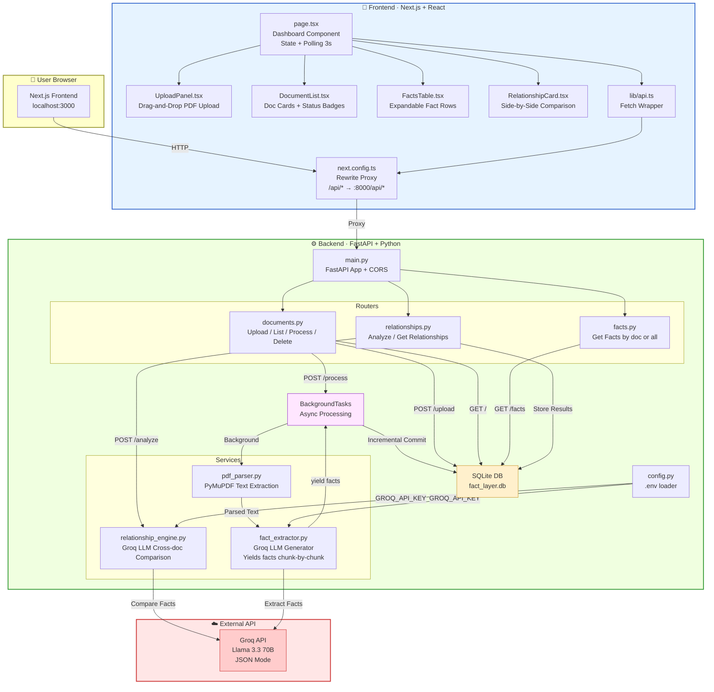
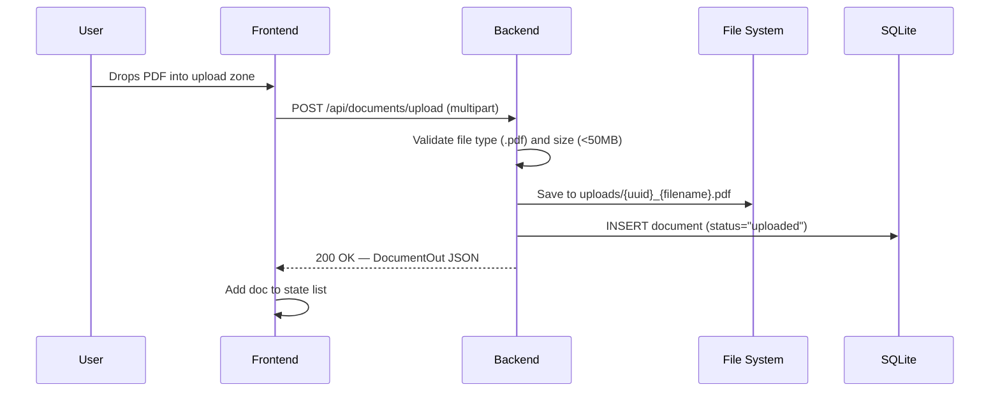
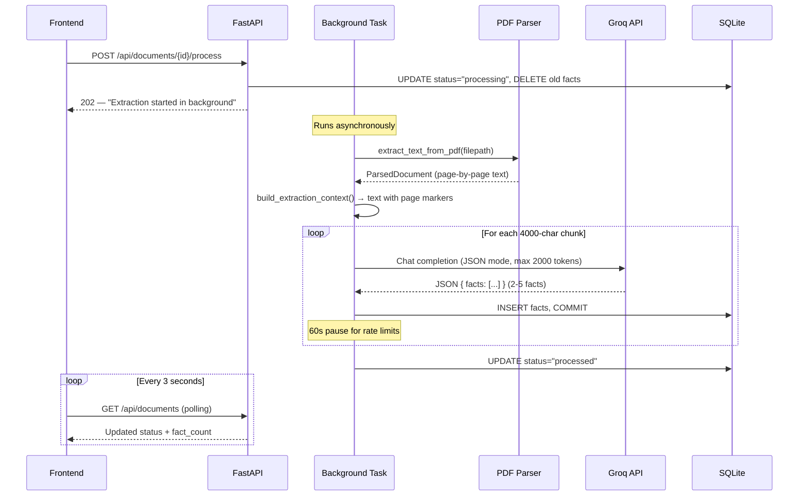
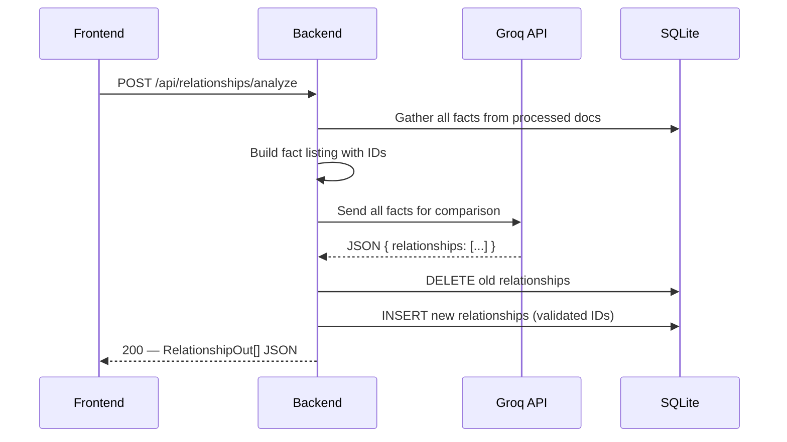

# Fact Knowledge Layer — Complete Architecture & Video Guide

## 🎯 What This Project Does (Elevator Pitch)

The **Fact Knowledge Layer** is a full-stack system that:
1. **Ingests** uploaded PDF documents
2. **Extracts** structured, grounded facts using an LLM (Groq / Llama 3.3 70B)
3. **Links** every fact to its exact source quote and page number
4. **Cross-references** facts across documents to find corroborations, contradictions, and contextual differences

---

## 🏗️ Architecture Diagram



---

## 📂 Project File Structure

```
superjoin-fact-layer/
├── backend/
│   ├── .env                    # GROQ_API_KEY (secret, gitignored)
│   ├── .env.example            # Template for .env
│   ├── config.py               # Loads env vars, defines paths
│   ├── database.py             # SQLAlchemy engine, session, Base
│   ├── main.py                 # FastAPI app entry point
│   ├── models.py               # ORM models: Document, Fact, Relationship
│   ├── schemas.py              # Pydantic schemas for API I/O
│   ├── requirements.txt        # Python dependencies
│   ├── uploads/                # Uploaded PDFs stored here
│   ├── fact_layer.db           # SQLite database (auto-created)
│   ├── routers/
│   │   ├── __init__.py
│   │   ├── documents.py        # Upload, list, process, delete endpoints
│   │   ├── facts.py            # Fact retrieval endpoints
│   │   └── relationships.py    # Relationship analysis endpoints
│   └── services/
│       ├── __init__.py
│       ├── pdf_parser.py       # PyMuPDF text extraction
│       ├── fact_extractor.py   # LLM fact extraction (generator)
│       └── relationship_engine.py  # LLM cross-doc comparison
├── frontend/
│   ├── next.config.ts          # API proxy rewrite rules
│   ├── app/
│   │   ├── globals.css         # Retro 2000s theme CSS
│   │   ├── layout.tsx          # Root layout with fonts
│   │   ├── page.tsx            # Main dashboard (state, polling, tabs)
│   │   └── components/
│   │       ├── UploadPanel.tsx      # Drag-and-drop file upload
│   │       ├── DocumentList.tsx     # Document cards with actions
│   │       ├── FactsTable.tsx       # Expandable facts table
│   │       ├── StatusBadge.tsx      # Color-coded status pills
│   │       └── RelationshipCard.tsx # Side-by-side fact comparison
│   └── lib/
│       └── api.ts              # Frontend API client (fetch wrapper)
├── venv/                       # Python virtual environment
└── README.md                   # Project documentation
```

---

## 🔄 Data Flow — Step by Step

### Flow 1: Upload a PDF



### Flow 2: Extract Facts (Background Processing)



### Flow 3: Analyze Cross-Document Relationships



---

## 📦 Backend — File-by-File Breakdown

### `config.py` — Configuration

| Variable | Source | Default | Purpose |
|----------|--------|---------|---------|
| `GROQ_API_KEY` | `.env` | `""` | Auth for Groq API |
| `GROQ_MODEL` | `.env` | `llama-3.3-70b-versatile` | Which LLM to use |
| `UPLOAD_DIR` | hardcoded | `backend/uploads/` | Where PDFs are saved |
| `DB_PATH` | hardcoded | `backend/fact_layer.db` | SQLite DB location |
| `MAX_UPLOAD_SIZE_MB` | hardcoded | `50` | Upload size limit |
| `ALLOWED_EXTENSIONS` | hardcoded | `{".pdf"}` | Accepted file types |

### `database.py` — Database Setup

| Export | Type | Purpose |
|--------|------|---------|
| `engine` | SQLAlchemy Engine | SQLite connection with `check_same_thread=False` |
| `SessionLocal` | sessionmaker | Creates DB sessions (used by routes + background tasks) |
| `Base` | DeclarativeBase | Base class for ORM models |
| `get_db()` | Generator | FastAPI dependency — yields session, auto-closes |
| `init_db()` | Function | Creates all tables on startup |

### `models.py` — ORM Models

#### `Document`
| Column | Type | Description |
|--------|------|-------------|
| `id` | String(36) PK | UUID |
| `filename` | String(255) | Original PDF filename |
| `upload_time` | DateTime | UTC timestamp |
| `page_count` | Integer (nullable) | Set after parsing |
| `status` | String(20) | `uploaded` → `processing` → `processed` / `error` |
| `error_message` | Text (nullable) | Error details if failed |
| `facts` | relationship | One-to-many → Fact (cascade delete) |

#### `Fact`
| Column | Type | Description |
|--------|------|-------------|
| `id` | String(36) PK | UUID |
| `document_id` | FK → documents.id | Which document |
| `claim` | Text | The factual statement |
| `value` | String(100) | Numerical value (if any) |
| `unit` | String(50) | Unit of measurement |
| `subject` | String(255) | What the fact is about |
| `time_context` | String(100) | Time period |
| `page_number` | Integer | Source page |
| `source_quote` | Text | Verbatim excerpt |
| `confidence` | Float | 0.0–1.0 confidence score |

#### `Relationship`
| Column | Type | Description |
|--------|------|-------------|
| `id` | String(36) PK | UUID |
| `fact_id_a` | FK → facts.id | First fact |
| `fact_id_b` | FK → facts.id | Second fact |
| `rel_type` | String(30) | `corroboration` / `contradiction` / `contextual_difference` / `extraction_failure` |
| `explanation` | Text | Why this relationship was identified |
| `context_detail` | Text (nullable) | What context resolves the difference |

### `services/pdf_parser.py` — PDF Text Extraction

| Function | Input | Output | Description |
|----------|-------|--------|-------------|
| `extract_text_from_pdf(filepath)` | `Path` | `ParsedDocument` | Uses PyMuPDF to extract text page-by-page, skips blank pages |
| `build_extraction_context(parsed)` | `ParsedDocument` | `str` | Concatenates pages with `--- PAGE N ---` markers for the LLM |

### `services/fact_extractor.py` — LLM Fact Extraction ⭐

**Key design: Generator pattern (`yield`)**

| Function | Input | Output | Description |
|----------|-------|--------|-------------|
| `_get_client()` | — | `Groq` | Singleton Groq client |
| `_chunk_text(text, max_chars=4000)` | `str` | `list[str]` | Splits on page boundaries to keep chunks under 4000 chars |
| `extract_facts(text, filename)` | `str, str` | `Generator[list[FactExtraction]]` | **Yields** 2-5 facts per chunk, sleeps 60s between chunks for rate limits |

**Why generator?** So the caller (`_process_document_bg`) can commit each batch to the DB immediately — facts appear in the UI while the rest of the document is still processing.

**Error resilience:** If Groq returns a 400 error on any chunk, it `continue`s to the next chunk instead of crashing the whole document.

### `services/relationship_engine.py` — Cross-Document Analysis

| Function | Input | Output | Description |
|----------|-------|--------|-------------|
| `analyze_relationships(facts_by_document)` | `dict[filename → list[fact_dict]]` | `list[RelationshipExtraction]` | Sends all facts to Groq with a comparison prompt, returns identified relationships |

**Relationship types:**
- **Corroboration** ✓ — Two sources agree
- **Contradiction** ✗ — Two sources conflict on the same subject/time
- **Contextual Difference** ◐ — Apparent contradiction explained by different time/scope/units
- **Extraction Failure** ⚠ — LLM suspects a fact was extracted incorrectly

### `routers/documents.py` — Document Endpoints

| Endpoint | Method | Description |
|----------|--------|-------------|
| `/api/documents/upload` | POST | Upload a PDF file |
| `/api/documents` | GET | List all documents with fact counts |
| `/api/documents/{id}/process` | POST | Start background extraction (returns immediately) |
| `/api/documents/{id}` | DELETE | Delete document + facts + file |

**Background task (`_process_document_bg`):**
1. Parses PDF → text
2. Iterates over `extract_facts()` generator
3. Commits each batch of facts to DB
4. Sets status to `processed` when done (or `error` if it crashes)

### `routers/facts.py` — Fact Endpoints

| Endpoint | Method | Description |
|----------|--------|-------------|
| `/api/facts` | GET | All facts across all documents |
| `/api/documents/{id}/facts` | GET | Facts for a specific document |

### `routers/relationships.py` — Relationship Endpoints

| Endpoint | Method | Description |
|----------|--------|-------------|
| `/api/relationships/analyze` | POST | Trigger cross-document analysis |
| `/api/relationships` | GET | Get previously computed relationships |

---

## 🎨 Frontend — Component Breakdown

### `page.tsx` — Dashboard (Main Orchestrator)

**State:**
- `documents`, `facts`, `relationships` — fetched from API
- `activeTab` — `"documents"` / `"facts"` / `"relationships"`
- `selectedDoc` — which document's facts to show
- `isAnalyzing`, `loading` — UI states

**Polling:** `useEffect` with `setInterval(3000ms)` calls `refreshDocuments()` and `refreshFacts()` so the UI updates live during background processing.

### `UploadPanel.tsx` — File Upload
- Drag-and-drop zone + click-to-browse
- Validates `.pdf` extension
- Calls `uploadDocument()` API → passes result up via `onUploadComplete`

### `DocumentList.tsx` — Document Cards
- Shows each document with: filename, page count, fact count, status badge
- **"Extract Facts"** button → calls `processDocument()` API
- **Delete** button → calls `deleteDocument()` API
- Clicking a processed document → navigates to Facts tab filtered to that doc

### `FactsTable.tsx` — Facts Display
- Classic HTML table with expandable rows
- Click any row to reveal the verbatim **source quote**
- Shows: claim, subject, value+unit, time context, page number, confidence %
- `ConfidenceDot` sub-component: green (≥90%), orange (≥70%), red (<70%)

### `StatusBadge.tsx` — Status Indicator
- Color-coded pill badge
- Animated pulsing dot for "processing" state

### `RelationshipCard.tsx` — Relationship Display
- Side-by-side comparison of Fact A vs Fact B
- Color-coded by relationship type
- Shows analysis explanation + context detail

### `lib/api.ts` — API Client
- All `fetch()` calls go through `/api/*` (proxied by Next.js)
- TypeScript interfaces for all response types
- Error handling with `res.json().catch()`

---

## 🎬 Video Script — Talking Points

### Intro (30s)
> "This is the Fact Knowledge Layer — a system I built for the Superjoin engineering assignment. It processes PDFs, extracts structured facts using AI, and then cross-references them to find agreements, contradictions, and contextual differences between documents."

### Demo Flow (2-3 min)

1. **Show the UI** — "The frontend is built with Next.js and has this fun retro early-2000s theme. Three tabs: Documents, Facts, and Relationships."

2. **Upload a PDF** — "I'll upload a PDF — it gets saved and a record is created in SQLite."

3. **Extract Facts** — "When I click Extract Facts, the backend starts processing in the background. The request returns immediately — you can see the status change to 'processing'. The system splits the document into chunks, sends each to Groq's Llama 3.3 70B model, and commits facts to the database as they come in. The UI polls every 3 seconds, so facts appear incrementally."

4. **View Facts** — "Each fact has a claim, subject, numerical value, time context, page number, and a confidence score. Click any row to see the exact source quote from the PDF — this is the evidence grounding."

5. **Upload second PDF + Analyze** — "Now I'll upload a second document and extract its facts too. With two processed documents, I can click 'Analyze Relationships'. The system sends all facts from both documents to the LLM and asks it to find corroborations, contradictions, contextual differences, and extraction failures."

6. **Show Relationships** — "Here you can see the results — facts compared side-by-side with color coding. Green for corroborations, red for contradictions, orange for contextual differences."

### Architecture (1 min)
> "Under the hood: the backend is FastAPI with SQLAlchemy and SQLite. The fact extractor uses a Python generator pattern — it yields facts chunk by chunk so they can be committed incrementally. The frontend polls every 3 seconds to pick up new facts as they arrive. Everything goes through a Next.js proxy so the browser never talks directly to the backend."

### Closing (15s)
> "Key technical decisions: generator pattern for streaming, background tasks for non-blocking processing, incremental DB commits for live updates, and error resilience — if one chunk fails, the rest still process."

---

## 🔑 Key Technical Decisions

| Decision | Why |
|----------|-----|
| **Generator pattern** for fact extraction | Enables incremental DB commits — facts appear live |
| **BackgroundTasks** (FastAPI) | Non-blocking — UI gets immediate response |
| **3-second polling** | Simple, reliable, no WebSocket complexity |
| **4000-char chunks** | Stays within Groq free-tier rate limits |
| **60-second pause** between chunks | Respects Groq's tokens-per-minute limit |
| **`continue` on API errors** | One bad chunk doesn't kill 93 good ones |
| **SQLite** | Zero-config, perfect for a demo |
| **Next.js rewrites** | Clean proxy, no CORS issues in browser |
| **Pydantic schemas** | Validates LLM JSON output automatically |
